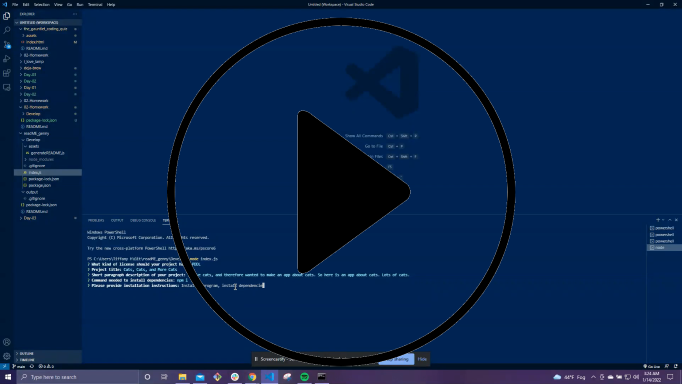

## Description
-------------

Created a simple README.md generator for future projects and applications.

The user utilizes node to activate the script, then they will be prompted with a series of questions.

Their answers to these questions will populate in a new README markdown file, which will generate in output folder once the questions are answered.

-------------------------------
## Video of application in use:

